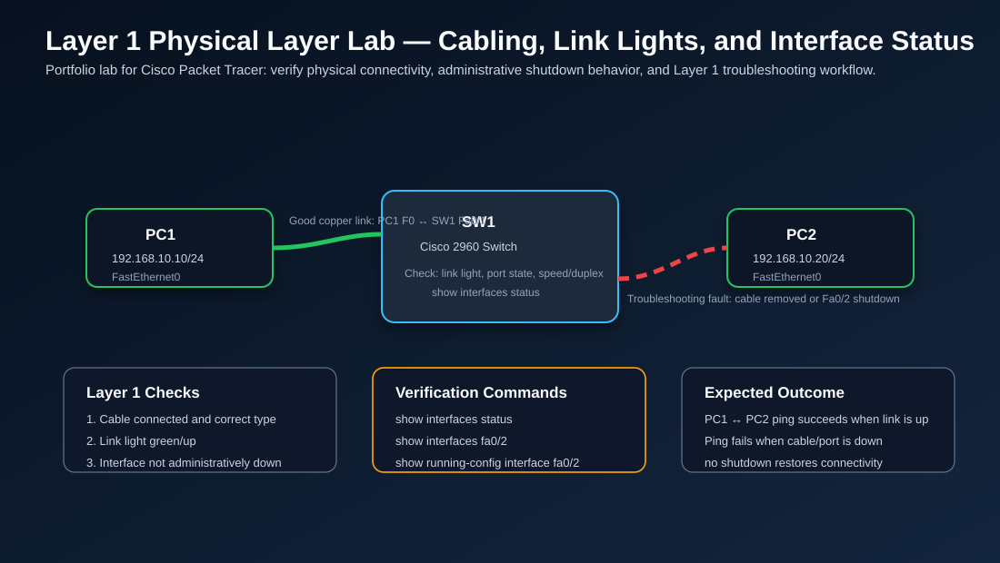

# Layer 1 Physical Layer Lab — Cabling, Link Lights, and Interface Status



## Objective

Build and document a Layer 1 troubleshooting lab that demonstrates how physical connectivity affects network communication. This lab focuses on cables, link lights, switch port status, administrative shutdown, speed/duplex awareness, and basic verification commands.

This lab supports job readiness for:

- IT Field Technician
- Junior Network Administrator
- Network Support Technician
- NOC Technician
- Cloud/Network Support roles

## Real-World Purpose

Many workplace network incidents start as simple Physical Layer problems. A user may report:

> “My internet is not working.”

Before troubleshooting DNS, DHCP, routing, firewall rules, or cloud services, a technician should verify Layer 1:

- Is the device powered on?
- Is the Ethernet cable connected?
- Is the switch port link light on?
- Is the cable connected to the correct wall jack or patch panel port?
- Is the switch port administratively shut down?
- Are there errors that suggest a bad cable, speed/duplex issue, or physical damage?

This is a practical troubleshooting habit used in enterprise offices, airports, banks, schools, warehouses, and small businesses.

## Topology

```text
PC1 -------- Fa0/1   SW1   Fa0/2 -------- PC2
```

## Devices Used

| Device | Type | Purpose |
|---|---|---|
| SW1 | Cisco 2960 Switch | Access switch used to verify physical port status |
| PC1 | End device | Test host 1 |
| PC2 | End device | Test host 2 |

## IP Addressing Table

| Device | Interface | IP Address | Subnet Mask |
|---|---|---:|---:|
| PC1 | FastEthernet0 | 192.168.10.10 | 255.255.255.0 |
| PC2 | FastEthernet0 | 192.168.10.20 | 255.255.255.0 |

## Cable and Port Plan

| Connection | Cable Type | Switch Port | Expected Link State |
|---|---|---|---|
| PC1 FastEthernet0 to SW1 Fa0/1 | Copper straight-through | Fa0/1 | Connected/up |
| PC2 FastEthernet0 to SW1 Fa0/2 | Copper straight-through | Fa0/2 | Connected/up |

## Lab Steps

### 1. Build the topology

1. Open Cisco Packet Tracer.
2. Add one Cisco 2960 switch and name it `SW1`.
3. Add two PCs and name them `PC1` and `PC2`.
4. Connect PC1 FastEthernet0 to SW1 Fa0/1.
5. Connect PC2 FastEthernet0 to SW1 Fa0/2.
6. Wait for the link lights to turn green.

### 2. Configure IP addresses on PCs

On PC1:

```text
IP Address: 192.168.10.10
Subnet Mask: 255.255.255.0
```

On PC2:

```text
IP Address: 192.168.10.20
Subnet Mask: 255.255.255.0
```

### 3. Verify physical port status

On SW1:

```bash
enable
show interfaces status
show interfaces fa0/1
show interfaces fa0/2
```

Expected result:

```text
Port      Status       Vlan       Duplex  Speed Type
Fa0/1     connected    1          a-full  a-100 10/100BaseTX
Fa0/2     connected    1          a-full  a-100 10/100BaseTX
```

### 4. Test connectivity

From PC1 command prompt:

```bash
ping 192.168.10.20
```

Expected result: ping succeeds when both cables and switch ports are working.

## Troubleshooting Scenario 1 — Cable Removed

### Problem

PC1 cannot ping PC2.

### Action

Disconnect the cable between PC2 and SW1 Fa0/2.

### Verify

```bash
show interfaces status
show interfaces fa0/2
```

Expected finding:

```text
Fa0/2     notconnect
```

### Root Cause

The physical link is down because the cable is disconnected.

### Fix

Reconnect the cable between PC2 and SW1 Fa0/2, wait for the link light to turn green, and test again:

```bash
ping 192.168.10.20
```

## Troubleshooting Scenario 2 — Port Administratively Down

### Problem

The cable is connected, but PC1 still cannot ping PC2.

### Create the issue

On SW1:

```bash
configure terminal
interface fa0/2
shutdown
end
```

### Verify

```bash
show interfaces status
show interfaces fa0/2
show running-config interface fa0/2
```

Expected finding:

```text
Fa0/2     disabled
```

or:

```text
FastEthernet0/2 is administratively down, line protocol is down
```

### Root Cause

The port is disabled by configuration, not by a bad cable.

### Fix

```bash
configure terminal
interface fa0/2
no shutdown
end
write memory
```

### Verify again

```bash
show interfaces status
ping 192.168.10.20
```

Expected result: the port returns to connected/up state and ping succeeds.

## Troubleshooting Methodology

Use this order when troubleshooting a user connectivity issue:

1. Confirm the device has power.
2. Confirm the Ethernet cable is connected.
3. Check link lights on the PC, phone, dock, wall jack, or switch port.
4. Verify the correct switch port or patch panel connection.
5. Run `show interfaces status`.
6. Check if the interface is `connected`, `notconnect`, `disabled`, or `err-disabled`.
7. Check `show running-config interface` to identify `shutdown` or incorrect settings.
8. Check error counters if the link is up but performance is poor.
9. Only after Layer 1 is confirmed, move to VLAN, IP, DNS, gateway, and routing checks.

## Common Mistakes

| Mistake | Why It Matters | Fix |
|---|---|---|
| Skipping physical checks | Wastes time troubleshooting higher layers | Always start at Layer 1 |
| Confusing `notconnect` and `disabled` | They have different causes | Check both status and running config |
| Forgetting `no shutdown` | Port remains administratively down | Enable the interface |
| Ignoring link lights | Misses obvious physical faults | Check endpoint and switch indicators |
| Not checking cable or patch panel | Issue may be outside the device | Trace the physical path |
| Troubleshooting DNS first | DNS cannot work if link is down | Verify Layer 1 before Layer 7 |

## Commands Cheat Sheet

```bash
enable
show interfaces status
show interfaces fa0/1
show interfaces fa0/2
show interfaces fa0/2 counters errors
show running-config interface fa0/2
show ip interface brief
configure terminal
interface fa0/2
shutdown
no shutdown
end
write memory
```

## Interview Explanation

If an interviewer asks, **“How do you troubleshoot a user who says the network is down?”**, you can answer:

> I start with Layer 1. I verify power, cable connection, link lights, correct wall jack or switch port, and switch interface status. On Cisco switches I use `show interfaces status` and `show running-config interface` to check whether the port is connected, disconnected, disabled, or administratively shut down. If Layer 1 is healthy, I continue upward to VLANs, IP addressing, gateway, DNS, routing, and firewall checks.

## Lessons Learned

- Layer 1 is the physical foundation of networking.
- A disconnected cable or disabled port can stop all higher-layer communication.
- `connected`, `notconnect`, and `disabled` have different meanings.
- `show interfaces status` is one of the fastest Cisco commands for field troubleshooting.
- A structured Layer 1-first workflow is important for real IT support jobs.

## Resume-Ready Bullet

> Built and documented a Cisco Packet Tracer Layer 1 troubleshooting lab verifying cabling, link lights, switch interface status, administrative shutdown behavior, and endpoint connectivity using Cisco IOS commands.

## Portfolio Evidence to Add Later

When completing the lab in Cisco Packet Tracer, add screenshots of:

- Topology workspace
- Green link lights when connected
- `show interfaces status` with ports connected
- Ping success from PC1 to PC2
- `notconnect` state after cable removal
- `disabled` or administratively down state after `shutdown`
- Restored connectivity after `no shutdown`
