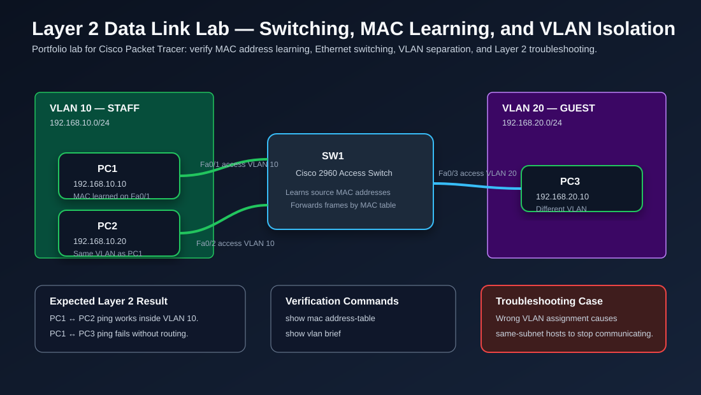

# Layer 2 Data Link Layer Lab — Switching, MAC Learning, and VLAN Isolation



## Objective

Build and document a Layer 2 switching lab that demonstrates how Ethernet switches learn MAC addresses, forward frames, separate traffic with VLANs, and how to troubleshoot common Data Link Layer problems.

This lab is designed for entry-level IT and networking roles such as:

- IT Field Technician
- Junior Network Administrator
- Network Support Technician
- NOC Technician
- Network Security Analyst trainee

## Real-World Purpose

Layer 2 problems are common in enterprise offices, airports, schools, banks, and small businesses. A user may say, “My network is down,” but the actual issue may be:

- The switch port is assigned to the wrong VLAN
- The switch has not learned the device MAC address
- The cable is connected but the port is administratively disabled
- A loop causes MAC address flapping
- An access port is misconfigured as the wrong VLAN

Understanding Layer 2 helps you troubleshoot before escalating to routing, firewall, DNS, or cloud teams.

## Topology

```text
VLAN 10 STAFF                         VLAN 20 GUEST

PC1 -------- Fa0/1                 Fa0/3 -------- PC3
192.168.10.10   \                 /               192.168.20.10
                 \               /
                  SW1 - Cisco 2960
                 /
PC2 -------- Fa0/2
192.168.10.20
```

## Devices Used

| Device | Type | Purpose |
|---|---|---|
| SW1 | Cisco 2960 Switch | Layer 2 switching and VLAN assignment |
| PC1 | End device | Staff user in VLAN 10 |
| PC2 | End device | Staff user in VLAN 10 |
| PC3 | End device | Guest user in VLAN 20 |

## IP Addressing Table

| Device | Interface | IP Address | Subnet Mask | VLAN |
|---|---|---:|---:|---:|
| PC1 | FastEthernet0 | 192.168.10.10 | 255.255.255.0 | 10 |
| PC2 | FastEthernet0 | 192.168.10.20 | 255.255.255.0 | 10 |
| PC3 | FastEthernet0 | 192.168.20.10 | 255.255.255.0 | 20 |

## VLAN Plan

| VLAN | Name | Purpose |
|---:|---|---|
| 10 | STAFF | Employee/user devices |
| 20 | GUEST | Guest or untrusted devices |

## Switch Port Plan

| Switch Port | Connected Device | Mode | VLAN |
|---|---|---|---:|
| Fa0/1 | PC1 | Access | 10 |
| Fa0/2 | PC2 | Access | 10 |
| Fa0/3 | PC3 | Access | 20 |

## Configuration Steps

### 1. Create VLANs

```bash
enable
configure terminal
vlan 10
 name STAFF
vlan 20
 name GUEST
exit
```

### 2. Configure Access Ports

```bash
interface fa0/1
 description PC1-STAFF
 switchport mode access
 switchport access vlan 10
 no shutdown
exit

interface fa0/2
 description PC2-STAFF
 switchport mode access
 switchport access vlan 10
 no shutdown
exit

interface fa0/3
 description PC3-GUEST
 switchport mode access
 switchport access vlan 20
 no shutdown
exit
end
write memory
```

## Verification Commands

### Check VLANs

```bash
show vlan brief
```

Expected result:

```text
VLAN Name                             Status    Ports
---- -------------------------------- --------- -------------------------------
10   STAFF                            active    Fa0/1, Fa0/2
20   GUEST                            active    Fa0/3
```

### Check Interface Status

```bash
show interfaces status
```

Expected result:

```text
Port      Status       Vlan       Duplex  Speed Type
Fa0/1     connected    10         a-full  a-100 10/100BaseTX
Fa0/2     connected    10         a-full  a-100 10/100BaseTX
Fa0/3     connected    20         a-full  a-100 10/100BaseTX
```

### Check MAC Address Learning

Generate traffic first by pinging between devices, then run:

```bash
show mac address-table
```

Expected concept:

```text
Vlan    Mac Address       Type        Ports
----    -----------       --------    -----
10      PC1-MAC           DYNAMIC     Fa0/1
10      PC2-MAC           DYNAMIC     Fa0/2
20      PC3-MAC           DYNAMIC     Fa0/3
```

## Connectivity Tests

### Test 1 — Same VLAN

From PC1:

```bash
ping 192.168.10.20
```

Expected result: **Success** because PC1 and PC2 are in the same VLAN and same subnet.

### Test 2 — Different VLAN Without Router

From PC1:

```bash
ping 192.168.20.10
```

Expected result: **Failure** because PC1 and PC3 are in different VLANs and there is no router or Layer 3 switch configured for inter-VLAN routing.

## Troubleshooting Scenario

### Problem

PC1 cannot ping PC2 even though both PCs are connected to the switch.

### Root Cause

Fa0/2 was accidentally assigned to VLAN 20 instead of VLAN 10.

### How to Detect

```bash
show vlan brief
show interfaces fa0/2 switchport
show mac address-table
```

You would notice that Fa0/2 appears under VLAN 20 instead of VLAN 10.

### Fix

```bash
configure terminal
interface fa0/2
 switchport mode access
 switchport access vlan 10
end
write memory
```

### Verify Again

```bash
show vlan brief
show mac address-table
```

From PC1:

```bash
ping 192.168.10.20
```

Expected result: ping succeeds after Fa0/2 is returned to VLAN 10.

## Troubleshooting Mindset

When troubleshooting Layer 2, use this order:

1. Confirm Layer 1: cable, link light, interface status
2. Confirm VLAN assignment: `show vlan brief`
3. Confirm port mode: access or trunk
4. Confirm MAC learning: `show mac address-table`
5. Confirm IP addressing only after Layer 2 looks correct
6. If different VLANs must communicate, confirm routing exists

## Common Mistakes

| Mistake | Why It Causes Problems | Fix |
|---|---|---|
| Wrong VLAN on access port | Host is isolated from expected subnet | Assign correct VLAN |
| Forgetting to create the VLAN | Port may not work as expected | Create VLAN first |
| Expecting VLANs to communicate without routing | VLANs are separate broadcast domains | Add router-on-a-stick or Layer 3 SVI |
| Not generating traffic before checking MAC table | Switch may not have learned MAC yet | Ping first, then check MAC table |
| Confusing MAC address with IP address | Layer 2 forwards by MAC, not IP | Separate Layer 2 and Layer 3 thinking |

## Interview Explanation

If an interviewer asks, **“How does a switch forward traffic?”**, you can answer:

> A Layer 2 switch learns MAC addresses by reading the source MAC address of incoming Ethernet frames. It stores the MAC address, VLAN, and ingress port in its MAC address table. When the switch receives a frame, it checks the destination MAC address. If the destination is known, it forwards the frame only out the correct port. If the destination is unknown, it floods the frame within the same VLAN. VLANs separate broadcast domains, so traffic in VLAN 10 is not forwarded into VLAN 20 unless a Layer 3 device routes between them.

## Commands Cheat Sheet

```bash
show vlan brief
show interfaces status
show interfaces fa0/1 switchport
show mac address-table
show running-config interface fa0/1
configure terminal
vlan 10
 name STAFF
interface fa0/1
 switchport mode access
 switchport access vlan 10
 no shutdown
end
write memory
```

## Lessons Learned

- Layer 2 switches forward Ethernet frames using MAC addresses.
- A switch learns MAC addresses from the source MAC of incoming frames.
- VLANs create separate Layer 2 broadcast domains.
- Devices in different VLANs need routing to communicate.
- `show vlan brief` and `show mac address-table` are essential troubleshooting commands.

## Resume-Ready Bullet

> Built and documented a Cisco Packet Tracer Layer 2 switching lab demonstrating MAC address learning, VLAN segmentation, access port configuration, connectivity testing, and troubleshooting of incorrect VLAN assignments.

## Portfolio Evidence to Add Later

When you complete this lab in Cisco Packet Tracer, add screenshots of:

- Topology workspace
- `show vlan brief`
- `show mac address-table`
- Successful PC1-to-PC2 ping
- Failed PC1-to-PC3 ping before inter-VLAN routing
- Troubleshooting fix for wrong VLAN assignment
