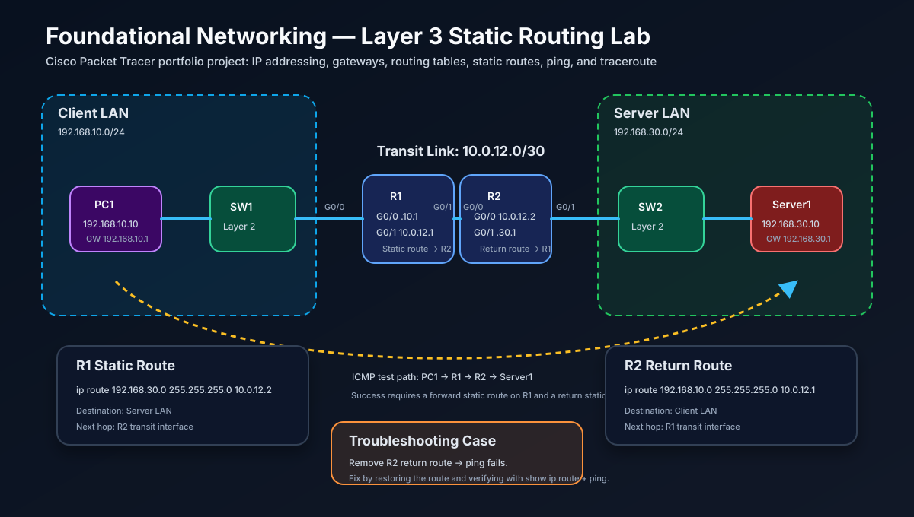

# Packet Tracer Layer 3 Routing Expanded Lab



## Project Summary

This project demonstrates **Layer 3 Network Layer fundamentals** using Cisco Packet Tracer. I configured two routers, three IP networks, static routes, and end-to-end connectivity between a client LAN and a server LAN. I verified the network with `show ip route`, `show ip interface brief`, `ping`, and `tracert`. I also tested a missing return-route failure and documented the troubleshooting process.

This lab is based on my daily IT training lesson for **Foundational Networking — Layer 3: Network Layer**.

## Objective

Build a routed environment where a PC in one subnet can communicate with a server in a different subnet through two routers. Then intentionally break routing and troubleshoot the issue using a professional Layer 3 workflow.

By completing this lab, I practiced:

- IPv4 addressing and subnet masks
- Default gateway behavior
- Router interface configuration
- Static routes
- Return-path troubleshooting
- Routing table verification
- ICMP testing with ping and traceroute
- Explaining Layer 3 concepts for IT support, NOC, network administrator, and cloud support interviews

## Real-World Purpose

Layer 3 troubleshooting appears in many real IT environments, including airports, banks, enterprise offices, data centers, ISPs, and cloud networks.

Example workplace issue:

> Gate agents at an airport can access their local network, but they cannot reach the passenger check-in application hosted in the data center.

A good IT support or NOC technician should check:

1. Does the workstation have the correct IP address, subnet mask, and default gateway?
2. Can the workstation ping its gateway?
3. Does the router know the destination network?
4. Does the destination side have a return route?
5. Is a firewall, ACL, or security policy blocking the traffic?
6. If IP connectivity works but names fail, is DNS working?

This lab proves that I understand the core routing logic behind those real incidents.

## Topology

```text
              10.0.12.0/30
PC1 --- SW1 --- R1 -------- R2 --- SW2 --- Server1
 |              |            |              |
192.168.10.0/24 |            |     192.168.30.0/24
```

## Devices Used

| Device | Type | Purpose |
|---|---|---|
| PC1 | End device | Client host in the 192.168.10.0/24 LAN |
| SW1 | Layer 2 switch | Connects PC1 to R1 |
| R1 | Router | Default gateway for PC1 LAN and first routed hop |
| R2 | Router | Gateway for Server1 LAN and return-routing device |
| SW2 | Layer 2 switch | Connects Server1 to R2 |
| Server1 | Server | Destination host in the 192.168.30.0/24 LAN |

## IP Addressing Plan

| Device | Interface | IP Address | Subnet Mask | Default Gateway |
|---|---|---:|---:|---:|
| PC1 | FastEthernet0 | 192.168.10.10 | 255.255.255.0 | 192.168.10.1 |
| R1 | G0/0 | 192.168.10.1 | 255.255.255.0 | N/A |
| R1 | G0/1 | 10.0.12.1 | 255.255.255.252 | N/A |
| R2 | G0/0 | 10.0.12.2 | 255.255.255.252 | N/A |
| R2 | G0/1 | 192.168.30.1 | 255.255.255.0 | N/A |
| Server1 | FastEthernet0 | 192.168.30.10 | 255.255.255.0 | 192.168.30.1 |

> Packet Tracer note: interface names may differ by router model. Some routers show `G0/0/0` instead of `G0/0`. The logic is the same; adjust interface names to match the device.

## Key Layer 3 Concepts Demonstrated

### IP Address

An IP address is a logical address assigned to a network device. It identifies the device and the network it belongs to.

Example: `192.168.10.10/24`

- Network: `192.168.10.0`
- Host: `10`
- Broadcast: `192.168.10.255`
- Usable range: `192.168.10.1` to `192.168.10.254`

### Default Gateway

A default gateway is the router IP address a host uses when the destination is outside the local subnet.

Example:

- PC1 IP: `192.168.10.10/24`
- PC1 gateway: `192.168.10.1`
- Destination server: `192.168.30.10`

PC1 sees that `192.168.30.10` is remote, so it sends the packet to `192.168.10.1`.

### Routing Table

A routing table is a list of known destination networks and where to send traffic next.

Common Cisco route codes:

| Code | Meaning |
|---|---|
| C | Connected route |
| L | Local interface route |
| S | Static route |
| O | OSPF route |
| D | EIGRP route |
| B | BGP route |
| * | Candidate default route |

### Static Route

A static route is manually configured by the administrator.

Syntax:

```bash
ip route DESTINATION_NETWORK SUBNET_MASK NEXT_HOP
```

Example:

```bash
ip route 192.168.30.0 255.255.255.0 10.0.12.2
```

Meaning:

> To reach `192.168.30.0/24`, send traffic to next-hop router `10.0.12.2`.

### Return Route

Communication needs routing in both directions. If PC1 can send traffic to Server1 but Server1's side does not know how to return traffic to `192.168.10.0/24`, the ping fails.

This is a very common real-world troubleshooting issue.

## Configuration Steps

### 1. Configure PC1

In Packet Tracer, open PC1 and configure:

```text
IP Address:      192.168.10.10
Subnet Mask:     255.255.255.0
Default Gateway: 192.168.10.1
```

### 2. Configure Server1

In Packet Tracer, open Server1 and configure:

```text
IP Address:      192.168.30.10
Subnet Mask:     255.255.255.0
Default Gateway: 192.168.30.1
```

### 3. Configure R1

```bash
enable
configure terminal
hostname R1
no ip domain-lookup
!
interface gigabitEthernet0/0
 description LAN to PC1 through SW1
 ip address 192.168.10.1 255.255.255.0
 no shutdown
!
interface gigabitEthernet0/1
 description Point-to-point link to R2
 ip address 10.0.12.1 255.255.255.252
 no shutdown
!
ip route 192.168.30.0 255.255.255.0 10.0.12.2
!
end
write memory
```

### 4. Configure R2

```bash
enable
configure terminal
hostname R2
no ip domain-lookup
!
interface gigabitEthernet0/0
 description Point-to-point link to R1
 ip address 10.0.12.2 255.255.255.252
 no shutdown
!
interface gigabitEthernet0/1
 description LAN to Server1 through SW2
 ip address 192.168.30.1 255.255.255.0
 no shutdown
!
ip route 192.168.10.0 255.255.255.0 10.0.12.1
!
end
write memory
```

## Verification Commands

### On R1

```bash
show ip interface brief
show ip route
show running-config | include ip route
ping 10.0.12.2
ping 192.168.30.1
ping 192.168.30.10
traceroute 192.168.30.10
```

### On R2

```bash
show ip interface brief
show ip route
show running-config | include ip route
ping 10.0.12.1
ping 192.168.10.1
ping 192.168.10.10
traceroute 192.168.10.10
```

### On PC1

```bash
ipconfig
ping 192.168.10.1
ping 10.0.12.2
ping 192.168.30.1
ping 192.168.30.10
tracert 192.168.30.10
```

## Expected Results

- PC1 can ping its gateway: `192.168.10.1`
- R1 can ping R2 on the transit link: `10.0.12.2`
- R2 can ping Server1: `192.168.30.10`
- PC1 can ping Server1 end-to-end: `192.168.30.10`
- `tracert 192.168.30.10` from PC1 shows the path through R1 and R2
- `show ip route` on R1 shows a static route to `192.168.30.0/24`
- `show ip route` on R2 shows a static route to `192.168.10.0/24`

## Troubleshooting Scenario

### Problem

PC1 cannot ping Server1.

### Intentional Break

On R2, remove the static return route:

```bash
enable
configure terminal
no ip route 192.168.10.0 255.255.255.0 10.0.12.1
end
```

### Symptoms

- PC1 can ping its gateway `192.168.10.1`
- R1 can reach R2
- R1 has a route to the server LAN
- End-to-end ping from PC1 to Server1 fails

### Root Cause

R2 is missing the return route to PC1's LAN: `192.168.10.0/24`.

Server1 sends the reply to R2, but R2 does not know how to send traffic back to `192.168.10.0/24`.

### Fix

Restore the R2 static route:

```bash
enable
configure terminal
ip route 192.168.10.0 255.255.255.0 10.0.12.1
end
write memory
```

### Verification After Fix

```bash
show ip route
ping 192.168.10.10
```

From PC1:

```bash
ping 192.168.30.10
tracert 192.168.30.10
```

## Troubleshooting Methodology

Use this professional Layer 3 checklist:

1. **Physical/link check**
   - Are cables connected?
   - Are interfaces `up/up`?
   - Cisco: `show ip interface brief`

2. **Host IP configuration**
   - Is the IP address correct?
   - Is the subnet mask correct?
   - Is the default gateway correct?
   - Windows: `ipconfig /all`
   - Linux/macOS: `ip addr`, `ip route`

3. **Gateway test**
   - Can the host ping its default gateway?
   - If not, check local LAN, switch port, VLAN, cable, or host configuration.

4. **Router interface check**
   - Does the gateway interface have the correct IP address?
   - Is the interface administratively up?

5. **Routing table check**
   - Does the router know the destination network?
   - Cisco: `show ip route`

6. **Return path check**
   - Does the destination-side router know how to return traffic?
   - Missing return routes are common in real incidents.

7. **Trace path**
   - Windows: `tracert destination`
   - Cisco/Linux/macOS: `traceroute destination`

8. **Security check**
   - Is an ACL, firewall rule, or cloud security group blocking the traffic?

9. **DNS check**
   - If ping by IP works but names fail, check DNS.

## Common Mistakes

| Mistake | Why It Causes Problems | How to Avoid It |
|---|---|---|
| Wrong default gateway | Host cannot send traffic outside its subnet | Gateway must be in the same subnet as the host |
| Missing `no shutdown` | Router interface stays administratively down | Always check `show ip interface brief` |
| Missing return route | Requests may arrive, but replies cannot return | Verify routing on both routers |
| Wrong subnet mask | Device thinks remote networks are local or local networks are remote | Confirm CIDR/subnet mask carefully |
| Static route points to wrong next hop | Router forwards traffic to the wrong device | Confirm next-hop IP is reachable |
| Only testing from router, not PC | Router ping may work while host settings are wrong | Test from the end device too |
| Assuming failed ping always means routing failure | ICMP can be blocked by firewalls | Check ACL/firewall rules and test other protocols |

## Interview Explanation

If an interviewer asks about Layer 3, I can say:

> Layer 3 is the Network Layer. It provides logical addressing and routing using IP addresses. In this Packet Tracer lab, I configured two routers and three IP networks. PC1 used its default gateway to reach a remote server network. R1 used a static route to forward traffic to R2, and R2 needed a return route back to PC1's LAN. I verified the routing table, interface status, ping, and traceroute, and I troubleshot a missing return-route failure.

## Interview Questions and Answers

### 1. What is Layer 3?

Layer 3 is the Network Layer. It provides logical addressing and routing using IP addresses. It allows devices on different networks to communicate through routers or Layer 3 switches.

### 2. What is the difference between a switch and a router?

A switch usually forwards frames within the same LAN using MAC addresses at Layer 2. A router forwards packets between different IP networks using IP addresses at Layer 3.

### 3. What is a default gateway?

A default gateway is the router IP address a host uses to send traffic outside its local subnet. Without the correct default gateway, the host may only communicate locally.

### 4. A user can ping their gateway but cannot reach a remote server. What would you check?

I would check the router's routing table, static or dynamic routes, the return route from the destination side, firewall or ACL rules, the server's default gateway, and traceroute output to see where the path stops.

### 5. What is a static route?

A static route is a manually configured route. It is useful in small or predictable networks, but it does not automatically adapt to topology changes.

### 6. What is a return route?

A return route is the path back to the source network. Communication requires routing in both directions. If the return route is missing, replies will fail.

### 7. Why is ARP still needed if devices use IP addresses?

IP addresses identify logical destinations, but Ethernet delivery on the local link needs MAC addresses. ARP maps an IPv4 address to a MAC address on the local network.

### 8. What changes and what stays the same as a packet crosses routers?

The Layer 2 MAC addresses change at every hop. The source and destination IP addresses usually stay the same end-to-end unless NAT is used.

### 9. What is longest prefix match?

Longest prefix match means the router chooses the most specific matching route in the routing table. For example, a `/24` route is preferred over a `/8` route for a matching destination.

### 10. How does Layer 3 apply in AWS or Azure?

Cloud networking still uses Layer 3 fundamentals: VPCs/VNets, CIDR blocks, subnets, route tables, internet gateways, NAT gateways, VPN gateways, and return paths.

## Commands Cheat Sheet

### Cisco IOS

```bash
show ip interface brief
show ip route
show running-config | section interface
show running-config | include ip route
show arp
show cdp neighbors
ping <destination-ip>
traceroute <destination-ip>
clear arp-cache
ip route <destination-network> <subnet-mask> <next-hop>
no ip route <destination-network> <subnet-mask> <next-hop>
```

### Windows

```powershell
ipconfig
ipconfig /all
ping <destination-ip>
tracert <destination-ip>
route print
arp -a
nslookup <domain-name>
netstat -rn
```

### Linux

```bash
ip addr
ip route
ping <destination-ip>
traceroute <destination-ip>
tracepath <destination-ip>
arp -a
ss -tulnp
resolvectl status
```

### macOS

```bash
ifconfig
netstat -rn
ping <destination-ip>
traceroute <destination-ip>
arp -a
scutil --dns
```

### AWS CLI Concepts for Future Cloud Labs

```bash
aws ec2 describe-vpcs
aws ec2 describe-subnets
aws ec2 describe-route-tables
aws ec2 describe-security-groups
aws ec2 describe-network-acls
```

## Lessons Learned

- Layer 3 moves traffic between different IP networks.
- A host uses its default gateway when the destination is outside the local subnet.
- Routers make forwarding decisions using routing tables.
- Static routes must be configured in both directions for end-to-end communication.
- A missing return route can break connectivity even when the forward path looks correct.
- `show ip route`, `show ip interface brief`, `ping`, and `traceroute` are essential troubleshooting tools.
- Cloud networking uses the same Layer 3 concepts through VPCs, subnets, gateways, and route tables.

## Portfolio Evidence and Screenshots to Add Later

After building this in Cisco Packet Tracer, add screenshots of:

- Full topology
- PC1 IP configuration
- Server1 IP configuration
- R1 `show ip interface brief`
- R2 `show ip interface brief`
- R1 `show ip route`
- R2 `show ip route`
- Successful ping from PC1 to Server1
- `tracert` from PC1 to Server1
- Broken lab test after removing the R2 return route
- Fixed lab test after restoring the R2 return route

## Resume-Ready Bullet

> Built and documented a Cisco Packet Tracer Layer 3 routing lab using IPv4 addressing, default gateways, `/30` transit links, static routes, routing-table verification, ping, and traceroute to troubleshoot end-to-end connectivity between multiple IP networks.

## LinkedIn Project Summary

> I completed a Layer 3 routing lab in Cisco Packet Tracer. The project includes two routers, three IP networks, static routes, and a troubleshooting scenario involving a missing return route. I documented the topology, IP addressing plan, router configurations, verification commands, troubleshooting steps, and interview explanations in my GitHub portfolio.
