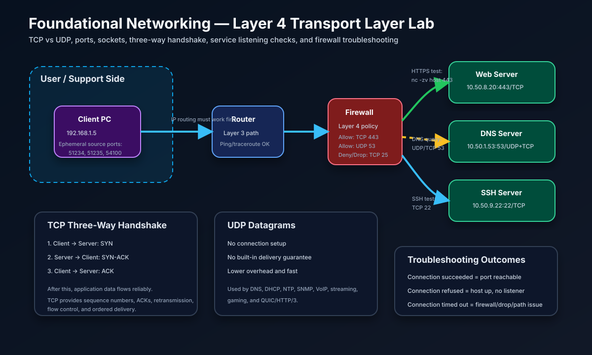

# Layer 4 Transport Layer Lab — TCP, UDP, Ports, and Connectivity Testing



## Project Summary

This project documents **OSI Layer 4 — the Transport Layer**. It explains how TCP, UDP, and port numbers allow multiple applications to communicate across the network. The lab focuses on practical troubleshooting commands such as `ss`, `netstat`, `nc`, `telnet`, `curl`, `tcpdump`, and `nmap`.

This lab is based on my daily IT training lesson for **Monday, June 8, 2026 — Layer 4: Transport Layer, TCP, UDP, and Ports**.

## Objective

Understand how Transport Layer communication works and how IT support, NOC, network administrator, and cloud support teams troubleshoot application connectivity problems.

By completing this lab, I practiced:

- Explaining TCP vs UDP
- Understanding TCP three-way handshake
- Understanding TCP reliability, acknowledgements, retransmission, and flow control
- Identifying common port numbers
- Testing whether a TCP port is open, closed, refused, or filtered
- Differentiating Layer 3 reachability from Layer 4 service availability
- Documenting real command evidence for a GitHub portfolio

## Real-World Purpose

In real IT jobs, users often say things like:

> “The application is not working.”

A strong technician does not guess. They separate the problem by layer:

1. **Layer 3:** Can I reach the host IP?
2. **Layer 4:** Can I reach the correct TCP/UDP port?
3. **Layer 5–7:** Is the application, TLS, DNS, or login service working?

Example workplace scenario:

> A Toronto bank user cannot access `https://hr.bank.internal`. Ping works, but the website times out.

Layer 4 troubleshooting helps determine whether:

- The web service is listening on TCP 443
- A host firewall is blocking TCP 443
- A network firewall is silently dropping packets
- The wrong port was used
- The service is down even though the server is reachable

This skill is very useful for NOC Technician, IT Support Specialist, Junior Network Administrator, Network Security Analyst, Cloud Support, and Systems Administrator roles.

## Topology

```text
Client PC
192.168.1.5:ephemeral-port
        |
        | TCP/UDP session test
        v
Router / Layer 3 Path
        |
        v
Firewall / ACL / Security Group
        |
        +---- TCP 443 ----> Web Server
        |
        +---- UDP/TCP 53 -> DNS Server
        |
        +---- TCP 22 -----> SSH Server
```

## Key Concepts

## What Layer 4 Does

The Transport Layer provides end-to-end communication between applications. It uses **ports** to identify which application should receive the data.

Layer 4 responsibilities include:

| Responsibility | Explanation |
|---|---|
| Segmentation | Breaks large application data into smaller transport units |
| Port numbering | Identifies applications using source and destination ports |
| Multiplexing | Allows multiple applications to share one IP address |
| Demultiplexing | Delivers received data to the correct application process |
| Connection management | TCP establishes and tears down sessions |
| Flow control | TCP prevents a fast sender from overwhelming a receiver |
| Error recovery | TCP retransmits lost data |

## TCP vs UDP

| Feature | TCP | UDP |
|---|---|---|
| Full name | Transmission Control Protocol | User Datagram Protocol |
| Connection setup | Yes, three-way handshake | No handshake |
| Reliability | Reliable | Best effort |
| Ordering | Guarantees ordered delivery | No ordering guarantee |
| Retransmission | Yes | No built-in retransmission |
| Speed | More overhead | Lower overhead and faster |
| Common uses | HTTPS, SSH, email, file transfer | DNS, DHCP, VoIP, gaming, streaming, NTP, SNMP |

### Simple Explanation

- **TCP** is like registered mail. It confirms delivery and keeps data in order.
- **UDP** is like sending flyers quickly. It is fast, but there is no built-in guarantee that every packet arrives.

## TCP Three-Way Handshake

Before TCP sends application data, the client and server establish a connection.

```text
CLIENT                                      SERVER
  |                                           |
  | -------- SYN --------------------------> |  Step 1: Can we talk?
  |                                           |
  | <------- SYN-ACK ----------------------- |  Step 2: Yes, I am ready.
  |                                           |
  | -------- ACK --------------------------> |  Step 3: Great, let's start.
  |                                           |
  | ======== APPLICATION DATA FLOWS ======== |
```

### What TCP Adds

TCP provides:

- Sequence numbers
- Acknowledgements
- Retransmission of lost data
- Sliding window flow control
- Congestion control
- Ordered delivery
- Connection teardown using FIN/ACK

## Ports and Sockets

A **port number** identifies the application or service.

A **socket pair** identifies a unique conversation:

```text
Client IP:Client Port  <-->  Server IP:Server Port
192.168.1.5:51234      <-->  10.50.8.20:443
```

If the same client opens two browser tabs to the same server, the destination can still be the same, but the client source ports are different:

```text
192.168.1.5:51234  <-->  10.50.8.20:443
192.168.1.5:51235  <-->  10.50.8.20:443
```

The operating system uses different ephemeral source ports to track separate sessions.

## Common Port Numbers

| Port | Protocol | Service | Job-Relevance Note |
|---:|---|---|---|
| 20 | TCP | FTP Data | Legacy file transfer |
| 21 | TCP | FTP Control | Legacy file transfer control channel |
| 22 | TCP | SSH | Secure remote administration |
| 23 | TCP | Telnet | Insecure remote login; avoid in production |
| 25 | TCP | SMTP | Email sending |
| 53 | TCP/UDP | DNS | Name resolution; UDP common, TCP for large responses/zone transfers |
| 67 | UDP | DHCP Server | IP address assignment |
| 68 | UDP | DHCP Client | IP address assignment |
| 69 | UDP | TFTP | Simple file transfer; sometimes used for device boot/config |
| 80 | TCP | HTTP | Unencrypted web traffic |
| 110 | TCP | POP3 | Email retrieval |
| 123 | UDP | NTP | Time synchronization |
| 143 | TCP | IMAP | Email synchronization |
| 161 | UDP | SNMP | Network monitoring queries |
| 162 | UDP | SNMP Trap | Network monitoring alerts |
| 389 | TCP/UDP | LDAP | Directory services |
| 443 | TCP | HTTPS | Secure web traffic |
| 445 | TCP | SMB | Windows file sharing |
| 514 | UDP/TCP | Syslog | Logging |
| 587 | TCP | SMTP Submission | Authenticated email submission |
| 636 | TCP | LDAPS | Secure LDAP |
| 993 | TCP | IMAPS | Secure IMAP |
| 995 | TCP | POP3S | Secure POP3 |
| 1433 | TCP | Microsoft SQL Server | Database connectivity |
| 1521 | TCP | Oracle DB | Database connectivity |
| 3306 | TCP | MySQL/MariaDB | Database connectivity |
| 3389 | TCP/UDP | RDP | Windows remote desktop |
| 5432 | TCP | PostgreSQL | Database connectivity |
| 8080 | TCP | Alternate HTTP / proxy / app server | Common internal application port |

## Mini Lab

## Lab Objective

Explore TCP/UDP ports, listening services, and connectivity testing from the command line.

## Required Tools

Use whichever tools are available on the system:

- Linux/macOS terminal
- `ss` or `netstat`
- `nc` / netcat
- `telnet` if available
- `curl`
- Optional: `tcpdump`, Wireshark, `nmap`

## Step-by-Step Instructions

### Part 1 — List Listening Ports

Linux:

```bash
ss -tlnp
ss -ulnp
ss -tnp state established
sudo ss -tlnp
```

macOS fallback:

```bash
netstat -an | grep LISTEN
netstat -an | grep ESTABLISHED
lsof -iTCP -sTCP:LISTEN -n -P
```

### Part 2 — Test TCP Port Connectivity

```bash
nc -zv scanme.nmap.org 22
nc -zv scanme.nmap.org 80
nc -zv scanme.nmap.org 443
nc -zv scanme.nmap.org 25
```

Expected interpretation:

| Output | Meaning |
|---|---|
| `succeeded` | Port is reachable and open |
| `connection refused` | Host is reachable, but nothing is listening or the service rejected the connection |
| `timed out` | Firewall, ACL, routing issue, or silent packet drop |

### Part 3 — Observe TCP Handshake

Linux example:

Terminal 1:

```bash
sudo tcpdump -i any port 80 -n
```

Terminal 2:

```bash
curl http://scanme.nmap.org
```

Look for:

```text
SYN
SYN-ACK
ACK
```

Wireshark display filter:

```text
tcp.flags.syn == 1 || tcp.flags.ack == 1
```

### Part 4 — Run a Local Test Service

Start a simple local web server:

```bash
python3 -m http.server 8888
```

In a second terminal:

```bash
nc -zv localhost 8888
curl http://localhost:8888
```

Then stop the Python server with `CTRL+C` and test again:

```bash
nc -zv localhost 8888
```

Expected result after stopping the service:

- Connection should fail because nothing is listening on port 8888.

## Verified Command Evidence

The following command evidence was collected on macOS while documenting this lab.

### Listening Ports

```text
$ netstat -an | grep LISTEN | head -5
tcp6       0      0  *.55015                *.*                    LISTEN
tcp4       0      0  *.38290                *.*                    LISTEN
tcp4       0      0  127.0.0.1.54477        *.*                    LISTEN
tcp6       0      0  fe80::aede:48ff:.54449 *.*                    LISTEN
tcp6       0      0  fe80::aede:48ff:.54448 *.*                    LISTEN
```

### Open TCP Port Test

```text
$ nc -zv scanme.nmap.org 80
Connection to scanme.nmap.org port 80 [tcp/http] succeeded!

$ nc -zv scanme.nmap.org 22
Connection to scanme.nmap.org port 22 [tcp/ssh] succeeded!
```

### Closed/Filtered Port Test

```text
$ nc -zv scanme.nmap.org 25
nc: connectx to scanme.nmap.org port 25 (tcp) failed: Connection refused
nc: connectx to scanme.nmap.org port 25 (tcp) failed: Operation timed out
```

Interpretation:

- Port 80 and 22 were reachable.
- Port 25 did not complete successfully.
- Different networks and firewalls can produce different results for closed, filtered, or blocked ports.

## Troubleshooting Scenario

## Problem

A user says:

> “I can ping the internal HR portal server, but the web page does not open.”

The URL is:

```text
https://hr.bank.internal
```

## Troubleshooting Steps

### Step 1 — Confirm DNS Resolution

```bash
nslookup hr.bank.internal
```

If DNS fails, troubleshoot DNS first.

### Step 2 — Confirm Layer 3 Reachability

```bash
ping hr.bank.internal
traceroute hr.bank.internal
```

If ping or traceroute fails, check routing, gateway, VPN, firewall, or ACLs.

### Step 3 — Test the Application Port

```bash
nc -zv hr.bank.internal 443
```

Possible results:

| Result | Meaning | Next Action |
|---|---|---|
| Connection succeeded | Port is reachable | Check TLS/application/login layer |
| Connection refused | Host reachable, but service may be stopped | Check web service status and listener |
| Connection timed out | Firewall or ACL likely dropping traffic | Check network firewall, host firewall, security group, or route path |

### Step 4 — Check Server Listening Ports

On the server:

```bash
ss -tlnp | grep 443
```

If nothing is listening, restart or troubleshoot the web service.

### Step 5 — Check Firewall Rules

Linux examples:

```bash
sudo iptables -L -n
sudo ufw status verbose
sudo firewall-cmd --list-all
```

Cloud examples:

- AWS Security Group inbound rule for TCP 443
- AWS Network ACL inbound/outbound rules
- Azure NSG inbound rule for TCP 443
- On-prem firewall policy between user VLAN and server VLAN

## Root Cause and Fix Example

### Root Cause

The HR portal server was reachable by IP, but TCP 443 timed out. The network firewall did not allow HTTPS from the user VLAN to the HR server VLAN.

### Fix

Add or request a firewall rule:

```text
Source: User VLAN subnet
Destination: HR portal server IP
Protocol: TCP
Port: 443
Action: Allow
```

### Verification

```bash
nc -zv hr.bank.internal 443
curl -Iv https://hr.bank.internal
```

Expected result:

- TCP 443 connects successfully.
- The HTTPS response returns headers or a TLS/application response.

## Common Mistakes

| Mistake | Why It Is a Problem | Correct Thinking |
|---|---|---|
| Confusing TCP and UDP | Leads to wrong troubleshooting path | Know which protocol the service uses |
| Thinking ping success means application success | Ping only proves basic reachability, not port availability | Test the exact TCP/UDP port |
| Forgetting ephemeral ports | Client source ports are temporary and usually high-numbered | Server listens on well-known ports; clients use ephemeral ports |
| Assuming UDP works like TCP | UDP has no handshake | Use correct UDP testing and packet capture |
| Misreading `connection refused` | Refused usually means the host replied but the port is closed | Check service listener |
| Misreading `timed out` | Timeout often means firewall drop or path issue | Check firewall/ACL/security group |
| Relying only on `netstat` on Linux | `netstat` is older/deprecated | Prefer `ss` on Linux |
| Opening unnecessary ports | Creates security risk | Open only required ports from required sources |

## Interview Explanation

If an interviewer asks how I troubleshoot application connectivity, I can say:

> I first separate Layer 3 reachability from Layer 4 service availability. I test DNS resolution, then ping or traceroute to confirm the host path. If the host is reachable, I test the exact port using `nc -zv host port` or `telnet host port`. If the connection is refused, I check whether the service is listening with `ss -tlnp`. If it times out, I suspect a firewall, ACL, security group, or silent packet drop. This helps me determine whether the issue is the network path, firewall, operating system, or application service.

## Interview Questions and Answers

### 1. What is the difference between TCP and UDP?

TCP is connection-oriented and reliable. It uses a three-way handshake, acknowledgements, sequence numbers, retransmission, and ordered delivery. UDP is connectionless and best effort. It has lower overhead and is often used when speed matters more than guaranteed delivery.

### 2. Explain the TCP three-way handshake.

The client sends SYN, the server replies with SYN-ACK, and the client sends ACK. After those three steps, the TCP connection is established and application data can flow.

### 3. What is a port number?

A port number identifies the application or service on a device. For example, HTTPS usually uses TCP 443 and SSH uses TCP 22.

### 4. What is an ephemeral port?

An ephemeral port is a temporary client-side source port chosen by the operating system for an outbound connection. It allows the OS to track multiple simultaneous sessions.

### 5. A user can ping a server but cannot open HTTPS. What do you check?

I would test TCP 443 using `nc -zv server 443` or `telnet server 443`. If refused, I check the web service listener. If timed out, I check firewalls, ACLs, security groups, and routing path.

### 6. What does `connection refused` mean?

It usually means the host is reachable, but nothing is listening on that port or the host rejected the connection with a reset.

### 7. What does `connection timed out` mean?

It often means a firewall, ACL, security group, or routing issue is silently dropping traffic. It can also happen if the host is unreachable.

### 8. Why does DNS use both TCP and UDP?

DNS primarily uses UDP 53 for fast small queries. It uses TCP 53 for large responses and zone transfers between DNS servers.

### 9. What command shows listening ports on Linux?

`ss -tlnp` shows listening TCP ports with process information. For UDP, use `ss -ulnp`.

### 10. What port does RDP use?

RDP uses TCP and UDP port 3389. It is important in Windows support and should be carefully restricted by firewall rules.

## Commands Cheat Sheet

### Linux

```bash
ss -tlnp
ss -ulnp
ss -tnp state established
ss -s
netstat -an
nc -zv HOST PORT
nc -zvu HOST PORT
curl -Iv https://HOST
sudo tcpdump -i any port 443 -n
sudo iptables -L -n
sudo ufw status verbose
```

### macOS

```bash
netstat -an | grep LISTEN
netstat -an | grep ESTABLISHED
lsof -iTCP -sTCP:LISTEN -n -P
nc -zv HOST PORT
curl -Iv https://HOST
sudo tcpdump -i any port 443 -n
```

### Windows PowerShell

```powershell
Test-NetConnection HOST -Port 443
netstat -ano
Get-NetTCPConnection -State Listen
Resolve-DnsName HOST
tracert HOST
```

### Nmap

```bash
nmap -sT HOST
nmap -sS HOST
nmap -sU HOST
nmap -p 22,80,443 HOST
nmap -p 1-1024 HOST
nmap -sV HOST
```

## Lessons Learned

- Layer 4 identifies applications using port numbers.
- TCP is reliable and connection-oriented.
- UDP is fast and connectionless.
- The TCP three-way handshake is SYN, SYN-ACK, ACK.
- Ping success does not prove that an application port is open.
- `connection refused` and `connection timed out` mean different things.
- Firewalls and security groups often allow or deny traffic based on protocol and port.
- Knowing common ports is a practical screening skill for Canadian IT support and NOC roles.

## Portfolio Evidence and Screenshots to Add Later

After completing the lab, add screenshots of:

- Listening ports from `ss`, `netstat`, or `lsof`
- Successful `nc -zv` test to TCP 80 or 443
- Failed/refused/timeout port test
- Wireshark or tcpdump capture showing SYN, SYN-ACK, ACK
- Optional `nmap` scan of a local test host
- Optional Python HTTP server on port 8888 with `nc` verification

## Resume-Ready Bullet

> Built and documented a Layer 4 transport troubleshooting lab covering TCP vs UDP, common service ports, TCP three-way handshake analysis, listening-port checks, netcat connectivity testing, and interpretation of refused versus timed-out connections for enterprise application support.

## LinkedIn Project Summary

> I completed a Transport Layer lab focused on TCP, UDP, ports, and application connectivity troubleshooting. The project includes a TCP three-way handshake explanation, common port reference table, real command evidence, troubleshooting workflows, and interview-ready explanations for IT support, NOC, and network administration roles.
