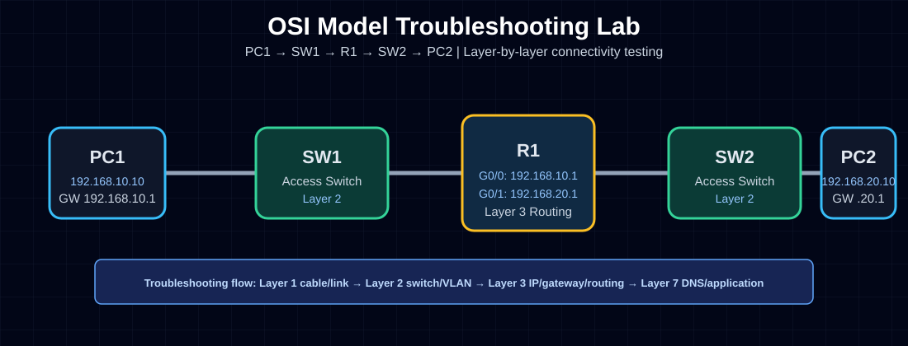

# OSI Model Troubleshooting Lab

## Objective
Use the OSI model as a structured troubleshooting method to diagnose and fix network connectivity problems.

## Real-World Purpose
In real IT jobs, especially IT Field Technician, Network Support, and Junior Network Administrator roles, users often report vague problems such as:

> “The internet is not working.”

The OSI model helps troubleshoot logically instead of guessing.

## Topology



```text
PC1 ---- SW1 ---- R1 ---- SW2 ---- PC2
```

## Addressing Table

| Device | Interface | IP Address | Subnet Mask | Default Gateway |
|---|---|---:|---:|---:|
| PC1 | FastEthernet0 | 192.168.10.10 | 255.255.255.0 | 192.168.10.1 |
| R1 | G0/0 | 192.168.10.1 | 255.255.255.0 | N/A |
| R1 | G0/1 | 192.168.20.1 | 255.255.255.0 | N/A |
| PC2 | FastEthernet0 | 192.168.20.10 | 255.255.255.0 | 192.168.20.1 |

## OSI Troubleshooting Method

| OSI Layer | What to Check | Example Commands |
|---:|---|---|
| 1 Physical | Cable, link light, port status | `show interfaces status` |
| 2 Data Link | VLAN, MAC address table, switch port | `show vlan brief`, `show mac address-table` |
| 3 Network | IP, subnet mask, gateway, routing | `ipconfig`, `show ip route`, `ping` |
| 4 Transport | TCP/UDP ports | `Test-NetConnection`, `nc -vz` |
| 5–7 Upper Layers | DNS, application, encryption | `nslookup`, `curl`, browser test |

## Router Configuration

```bash
enable
configure terminal
hostname R1

interface gigabitEthernet0/0
 description LAN-10-to-PC1
 ip address 192.168.10.1 255.255.255.0
 no shutdown
exit

interface gigabitEthernet0/1
 description LAN-20-to-PC2
 ip address 192.168.20.1 255.255.255.0
 no shutdown
exit

end
write memory
```

## Verification Commands

### On Router

```bash
show ip interface brief
show running-config
show ip route
```

### On PCs

```bash
ipconfig
ping 192.168.10.1
ping 192.168.20.1
ping 192.168.20.10
```

## Expected Results

- PC1 can ping its gateway: `192.168.10.1`
- PC2 can ping its gateway: `192.168.20.1`
- PC1 can ping PC2: `192.168.20.10`

## Troubleshooting Practice

Break the lab intentionally:

1. Change PC1 default gateway to `192.168.10.254`.
2. Try to ping PC2.
3. Use OSI troubleshooting to find the issue.
4. Fix the gateway back to `192.168.10.1`.

## Troubleshooting Notes

| Problem | Layer | Fix |
|---|---:|---|
| No link light | Layer 1 | Check cable and port |
| Wrong VLAN | Layer 2 | Correct switchport VLAN |
| Wrong default gateway | Layer 3 | Set correct gateway |
| DNS fails but IP ping works | Layer 7 | Check DNS server/settings |

## What I Learned

- The OSI model is a troubleshooting framework, not just theory.
- Layer 1 problems are often physical cable or port issues.
- Layer 2 problems involve switching, VLANs, and MAC addresses.
- Layer 3 problems involve IP addressing, gateways, and routing.
- A structured troubleshooting method is important in real IT support jobs.

## Interview Explanation

If an interviewer asks how I troubleshoot network issues, I can say:

> I use the OSI model to troubleshoot step by step. I start at Layer 1 by checking physical connectivity, then Layer 2 for VLAN and switching issues, then Layer 3 for IP addressing, gateway, and routing. After confirming network connectivity, I check Layer 4 ports and upper-layer services like DNS or the application itself.

## Skills Demonstrated

- OSI model troubleshooting
- Cisco Packet Tracer
- Router interface configuration
- IP addressing
- Ping testing
- Gateway troubleshooting
- Documentation
