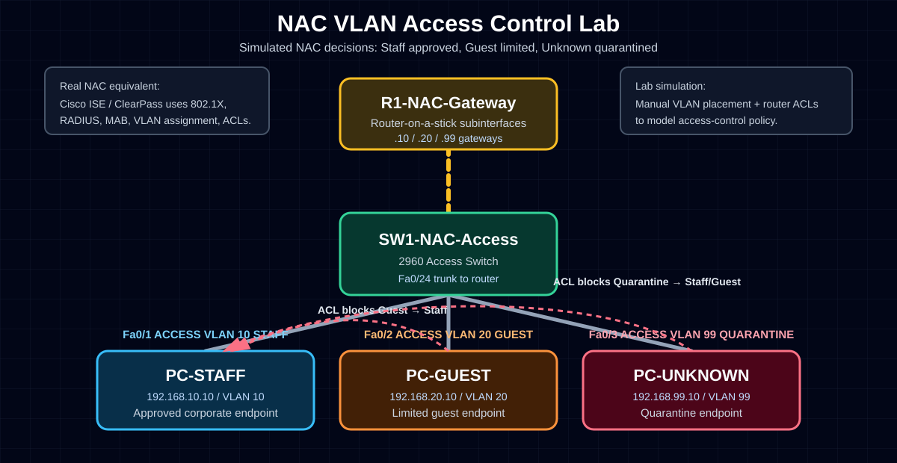

# NAC VLAN Access Control Lab

## Objective
Simulate Network Access Control (NAC)-style segmentation using VLANs and ACLs in Cisco Packet Tracer.

## Real-World Purpose
In enterprise environments, NAC platforms such as Cisco ISE, Aruba ClearPass, FortiNAC, and Microsoft NPS control which devices can access the network.

This lab simulates NAC decisions manually:

- Approved corporate endpoint → Staff VLAN
- Guest endpoint → Guest VLAN
- Unknown/non-compliant endpoint → Quarantine VLAN

## Topology



```text
                 R1-NAC-Gateway
                    G0/0
                     |
                     | 802.1Q Trunk
                     |
                    Fa0/24
                 SW1-NAC-Access
        Fa0/1        Fa0/2        Fa0/3
          |            |            |
      PC-STAFF     PC-GUEST    PC-UNKNOWN
      VLAN 10      VLAN 20      VLAN 99
```

## VLAN Table

| VLAN | Name | Purpose | Subnet |
|---:|---|---|---:|
| 10 | STAFF | Approved corporate users | 192.168.10.0/24 |
| 20 | GUEST | Guest users with limited access | 192.168.20.0/24 |
| 99 | QUARANTINE | Unknown or non-compliant devices | 192.168.99.0/24 |

## Addressing Table

| Device | IP Address | Subnet Mask | Default Gateway | VLAN |
|---|---:|---:|---:|---:|
| PC-STAFF | 192.168.10.10 | 255.255.255.0 | 192.168.10.1 | 10 |
| PC-GUEST | 192.168.20.10 | 255.255.255.0 | 192.168.20.1 | 20 |
| PC-UNKNOWN | 192.168.99.10 | 255.255.255.0 | 192.168.99.1 | 99 |
| R1 G0/0.10 | 192.168.10.1 | 255.255.255.0 | N/A | 10 |
| R1 G0/0.20 | 192.168.20.1 | 255.255.255.0 | N/A | 20 |
| R1 G0/0.99 | 192.168.99.1 | 255.255.255.0 | N/A | 99 |

## Switch Configuration

```bash
enable
configure terminal
hostname SW1-NAC-Access

vlan 10
 name STAFF
exit

vlan 20
 name GUEST
exit

vlan 99
 name QUARANTINE
exit

interface fastEthernet0/1
 description PC-STAFF - NAC approved corporate device
 switchport mode access
 switchport access vlan 10
 spanning-tree portfast
exit

interface fastEthernet0/2
 description PC-GUEST - limited guest device
 switchport mode access
 switchport access vlan 20
 spanning-tree portfast
exit

interface fastEthernet0/3
 description PC-UNKNOWN - failed NAC posture/quarantine
 switchport mode access
 switchport access vlan 99
 spanning-tree portfast
exit

interface fastEthernet0/24
 description TRUNK-to-R1-NAC-Gateway
 switchport mode trunk
 switchport trunk allowed vlan 10,20,99
 no shutdown
exit

end
write memory
```

## Router Configuration

```bash
enable
configure terminal
hostname R1-NAC-Gateway

interface gigabitEthernet0/0
 description TRUNK-to-SW1-NAC-Access
 no ip address
 no shutdown
exit

interface gigabitEthernet0/0.10
 description STAFF-VLAN-Gateway
 encapsulation dot1Q 10
 ip address 192.168.10.1 255.255.255.0
exit

interface gigabitEthernet0/0.20
 description GUEST-VLAN-Gateway
 encapsulation dot1Q 20
 ip address 192.168.20.1 255.255.255.0
 ip access-group BLOCK-GUEST-TO-STAFF in
exit

interface gigabitEthernet0/0.99
 description QUARANTINE-VLAN-Gateway
 encapsulation dot1Q 99
 ip address 192.168.99.1 255.255.255.0
 ip access-group QUARANTINE-LIMITED in
exit

ip access-list extended BLOCK-GUEST-TO-STAFF
 remark Guest VLAN cannot access Staff VLAN
 deny ip 192.168.20.0 0.0.0.255 192.168.10.0 0.0.0.255
 permit ip any any
exit

ip access-list extended QUARANTINE-LIMITED
 remark Quarantine VLAN cannot access Staff or Guest VLAN
 deny ip 192.168.99.0 0.0.0.255 192.168.10.0 0.0.0.255
 deny ip 192.168.99.0 0.0.0.255 192.168.20.0 0.0.0.255
 permit ip any any
exit

end
write memory
```

## Verification Commands

### Switch

```bash
show vlan brief
show interfaces trunk
show running-config interface fastEthernet0/1
show running-config interface fastEthernet0/2
show running-config interface fastEthernet0/3
show running-config interface fastEthernet0/24
```

### Router

```bash
show ip interface brief
show access-lists
show running-config interface gigabitEthernet0/0.10
show running-config interface gigabitEthernet0/0.20
show running-config interface gigabitEthernet0/0.99
```

## Test Results

| Test | Expected Result | Actual Result |
|---|---|---|
| PC-STAFF → 192.168.10.1 | Success | To be added |
| PC-GUEST → 192.168.20.1 | Success | To be added |
| PC-UNKNOWN → 192.168.99.1 | Success | To be added |
| PC-GUEST → PC-STAFF | Fail / blocked | To be added |
| PC-UNKNOWN → PC-STAFF | Fail / blocked | To be added |
| PC-UNKNOWN → PC-GUEST | Fail / blocked | To be added |

## Troubleshooting Checklist

1. Check PC IP address, subnet mask, and default gateway.
2. Check switch VLAN assignment with `show vlan brief`.
3. Check trunk with `show interfaces trunk`.
4. Check router subinterfaces with `show ip interface brief`.
5. Check ACLs with `show access-lists`.
6. If first ping fails but second works, remember ARP may need time.

## What I Learned

- NAC controls which devices can access the network.
- Real NAC can assign VLANs dynamically using RADIUS and 802.1X.
- VLANs separate users into security zones.
- ACLs enforce restrictions between VLANs.
- Quarantine VLANs are used for unknown or non-compliant devices.

## Interview Explanation

If an interviewer asks about NAC, I can say:

> I built a Cisco Packet Tracer lab that simulates NAC-style access control. I separated approved staff, guest, and unknown devices into VLAN 10, VLAN 20, and VLAN 99. I used router-on-a-stick for inter-VLAN routing and applied ACLs to block guest and quarantine devices from accessing the staff network. This helped me understand how enterprise NAC platforms like Cisco ISE use identity and posture policies to assign network access.

## Skills Demonstrated

- VLAN design
- Access ports
- 802.1Q trunking
- Router-on-a-stick
- Extended ACLs
- NAC concepts
- Quarantine network design
- Cisco IOS verification
- Network security documentation
